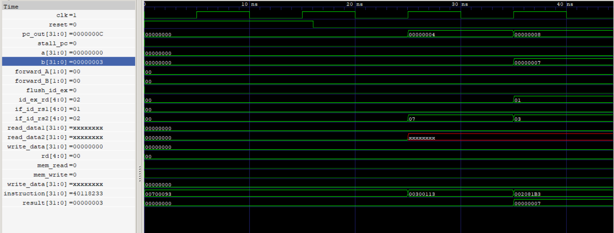
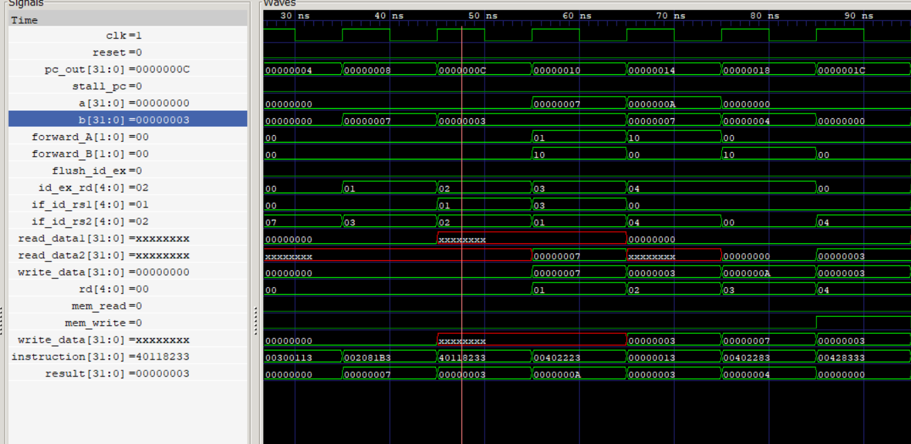
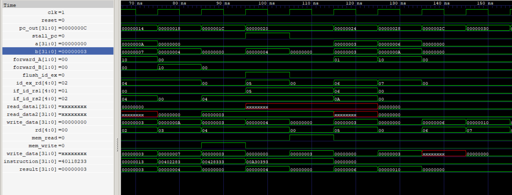

# 5-Stage-Pipelined-RISC-V-CPU

A 5-stage pipelined RISC-V CPU implemented in Verilog, featuring data forwarding and hazard detection, simulated and verified using Icarus Verilog and GTKWave.

**Author:** Jashwanth

---

## Overview

This project implements a classic 5-stage RISC-V pipeline:

```
IF  →  ID  →  EX  →  MEM  →  WB
```

| Stage | Function |
|---|---|
| **IF** (Instruction Fetch) | Fetches the instruction from instruction memory using the PC |
| **ID** (Instruction Decode) | Decodes the instruction, reads register file, generates immediates and control signals |
| **EX** (Execute) | Performs ALU operations, resolves forwarding |
| **MEM** (Memory Access) | Reads/writes data memory for loads and stores |
| **WB** (Write Back) | Writes the result back into the register file |

The design includes:
- **Data forwarding** (EX/MEM → EX and MEM/WB → EX) to resolve RAW hazards without stalling wherever possible
- **Hazard detection unit** to stall the pipeline on load-use hazards
- **Control/branch hazard handling** via pipeline flush

---

## Repository Structure

```
5-stage-pipelined-riscv-cpu/
├── rtl/                  # All Verilog source modules (CPU datapath and control)
├── tb/                   # Testbenches
├── docs/                 # Waveform screenshots and writeups
├── waveforms
└── README.md
```

---

## Modules

| Module | Purpose |
|---|---|
| `pipeline_cpu_top.v` | Top-level module connecting all stages |
| `pc.v` | Program counter |
| `instr_mem.v` | Instruction memory |
| `if_id.v` | IF/ID pipeline register |
| `control_unit.v` | Main control signal generator |
| `regfile.v` | Register file (32 registers) |
| `imm_gen.v` | Immediate value generator |
| `alu_control.v` | ALU operation decoder |
| `id_ex.v` | ID/EX pipeline register |
| `ALU.v` | Arithmetic Logic Unit |
| `ex_mem.v` | EX/MEM pipeline register |
| `data_mem.v` | Data memory |
| `mem_wb.v` | MEM/WB pipeline register |
| `forwarding_unit.v` | Resolves RAW hazards via forwarding |
| `hazard_detection_unit.v` | Detects load-use hazards and stalls the pipeline |

---

## Hazards Handled

### 1. Data Hazards (RAW) — resolved via Forwarding

When an instruction needs a register value that hasn't been written back yet, the Forwarding Unit routes the value directly from a later pipeline stage into the ALU inputs, instead of waiting for the register file write.

| Forwarding Path | Condition |
|---|---|
| EX/MEM → EX | Previous instruction's ALU result is needed by the current instruction in EX |
| MEM/WB → EX | An instruction two cycles ahead has its result needed, and it hasn't reached EX/MEM forwarding window |

### 2. Load-Use Hazard — resolved via Stalling

Forwarding alone cannot resolve a hazard where the very next instruction needs a value that is still being loaded from memory (the data isn't available until after the MEM stage). In this case, the Hazard Detection Unit:
- Freezes the PC and IF/ID register for one cycle
- Inserts a bubble (NOP) into the EX stage
- Once the load completes, the value is forwarded into EX the following cycle

---

## Simulated Test Case & Verified Trace

The following instruction sequence was used to verify both forwarding and load-use hazard handling in a single test (see `tb/tb3_combined.v`):

```
[0] ADDI x1, x0, 7      → x1 = 7
[1] ADDI x2, x0, 3      → x2 = 3
[2] ADD  x3, x1, x2     → x3 = 10   (double forwarding: MEM/WB→x1, EX/MEM→x2)
[3] SUB  x4, x3, x1     → x4 = 3    (EX/MEM forward on x3)
[4] SW   x4, 4(x0)      → mem[1]=3 (EX/MEM forward on x4, store data)
[5] NOP
[6] LW   x5, 4(x0)      → x5 = 3
[7] ADD  x6, x5, x4     → x6 = 6    (LOAD-USE HAZARD → 1-cycle stall, then forward)
[8] ADDI x7, x6, 10     → x7 = 16   (EX/MEM forward on x6)
```

**Expected results:** `x1=7, x2=3, x3=10, x4=3, x5=3, x6=6, x7=16`, `dmem[1]=3`, `stall_cycles=1`

### Pipeline Occupancy Trace

| Cycle | IF | ID | EX | MEM | WB |
|---|---|---|---|---|---|
| 1 | I0 `ADDI x1,x0,7` | — | — | — | — |
| 2 | I1 `ADDI x2,x0,3` | I0 | — | — | — |
| 3 | I2 `ADD x3,x1,x2` | I1 | I0 | — | — |
| 4 | I3 `SUB x4,x3,x1` | I2 | I1 | I0 | — |
| 5 | I4 `SW x4,4(x0)` | I3 | I2 | I1 | I0 |
| 6 | I5 `NOP` | I4 | I3 | I2 | I1 |
| 7 | I6 `LW x5,4(x0)` | I5 | I4 | I3 | I2 |
| 8 | I7 `ADD x6,x5,x4` | I6 | I5 | I4 | I3 |

### Load-Use Hazard & Forwarding — Detailed Trace

| Time | Instruction | Event | ALU inputs (a, b) | Result |
|---|---|---|---|---|
| I6 in EX | `LW x5,4(x0)` | Load in progress | — | — |
| I7 in ID | `ADD x6,x5,x4` | **Hazard detected** — x5 not ready | — | — |
| Stall cycle | — | PC & IF/ID frozen, bubble inserted into EX | — | — |
| I7 in EX | `ADD x6,x5,x4` | `forward_A=01` (MEM/WB → EX) | a=3, b=3 | 6 |
| I8 in EX | `ADDI x7,x6,10` | `forward_A=10` (EX/MEM → EX) | a=6, b=10 | 16 |

This confirms: hazard detection correctly triggers a single-cycle stall, and both forwarding paths (EX/MEM and MEM/WB) correctly resolve dependent instructions back-to-back without any incorrect results.

---

## Waveforms

Simulation waveforms (captured in GTKWave) illustrating the pipeline behavior:


*Reset held for 2 cycles — PC stays at 0 as expected before instructions begin fetching.*


*EX/MEM and MEM/WB forwarding resolving RAW hazards between ADD/SUB/SW instructions.*


*Load-use hazard detected — PC and IF/ID frozen for one cycle, bubble inserted into EX, followed by MEM/WB and EX/MEM forwarding.*

> Replace the image filenames above with your actual screenshot files placed in `docs/`.

---

## How to Run the Simulation

**Requirements:** [Icarus Verilog](http://bleyer.org/icarus/) and [GTKWave](http://gtkwave.sourceforge.net/) installed and available on your PATH.

```bash
# From the project root
cd tb
iverilog -o tb3.out ../rtl/*.v tb3_combined.v
vvp tb3.out
gtkwave tb3_combined.vcd
```

This compiles all RTL modules together with the combined testbench, runs the simulation, prints PASS/FAIL results for each register and memory check to the console, and generates a `.vcd` waveform file for inspection in GTKWave.

---

## Verification Summary

| Check | Result |
|---|---|
| EX/MEM forwarding | ✅ Pass |
| MEM/WB forwarding | ✅ Pass |
| Double forwarding (same cycle) | ✅ Pass |
| Store-value forwarding | ✅ Pass |
| Load-use hazard stall | ✅ Pass (1 cycle, as expected) |
| Post-stall forwarding | ✅ Pass |

---

## License

This project is open for educational use. Feel free to fork and build on it.
